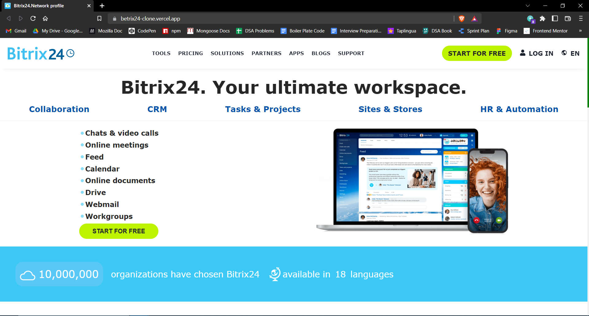
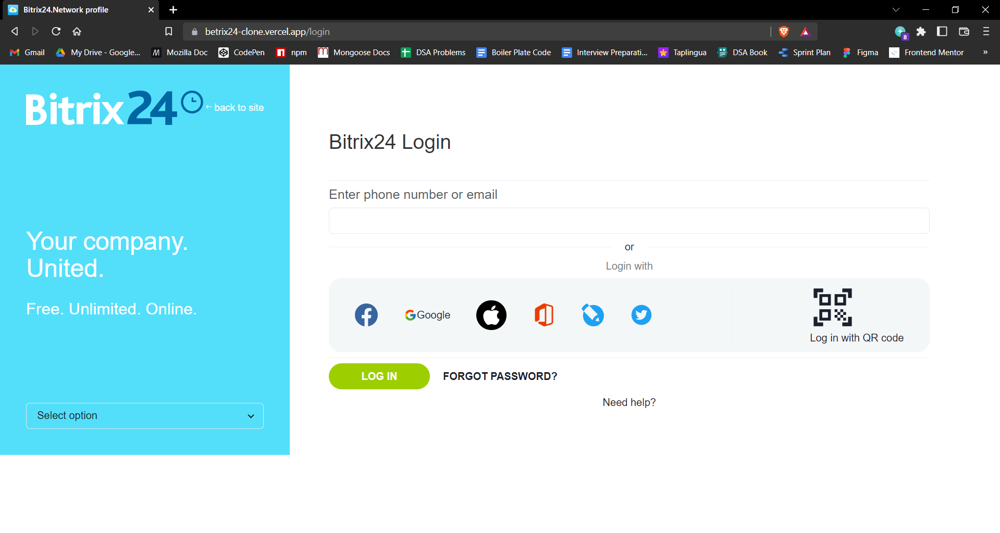
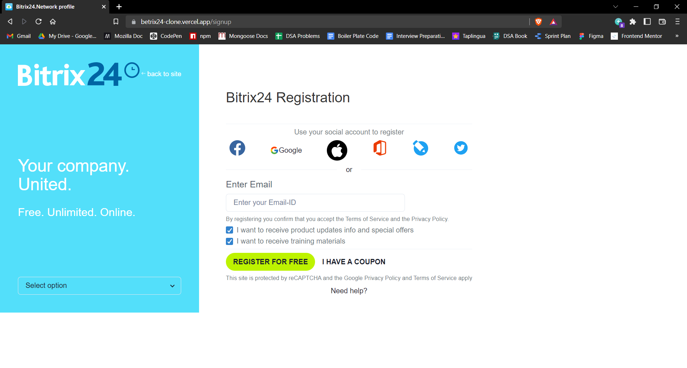
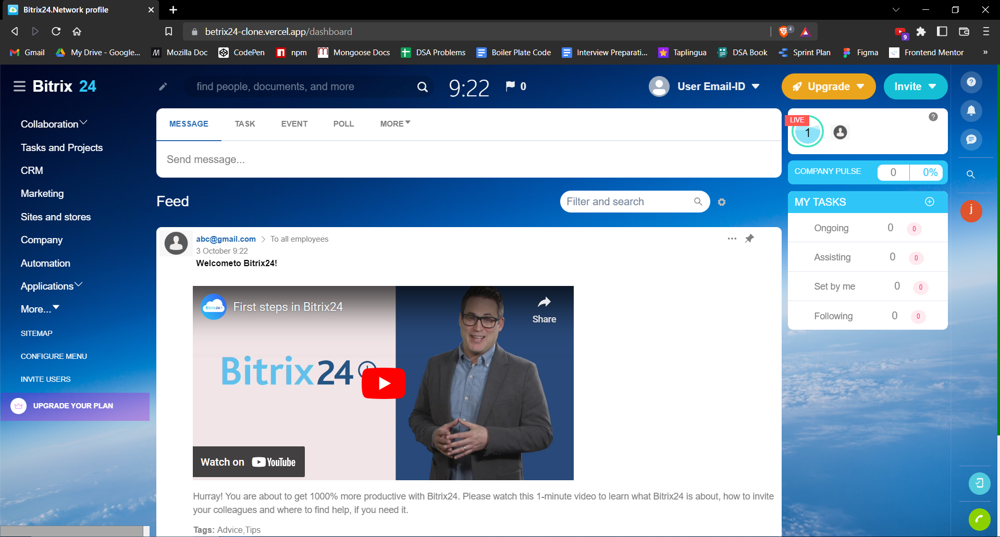
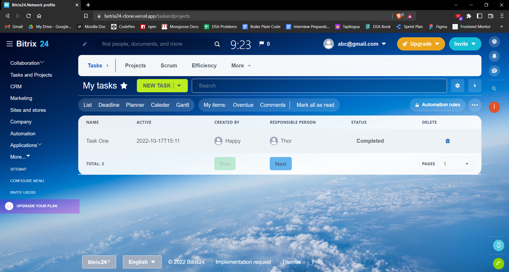
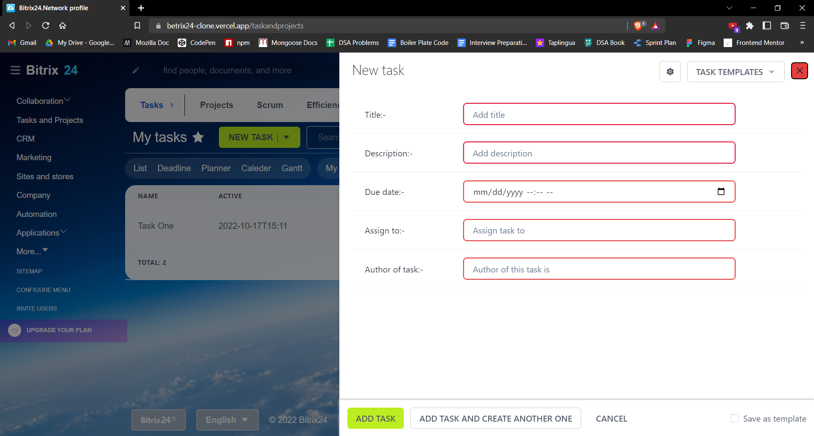

# Bitrix24 Clone

- Hello everyone, we are a group of 5 members who created a clone of [Bitrix24](https://www.bitrix24.net/) in our construct week at Masai School.
- Bitrix24 is a united workspace that handles many aspects of daily operations and tasks like customer relationship management, project management & collaboration platform for your business management.
- Link of frontend deployment ⏩ [Vercel](https://betrix24-clone.vercel.app/)
- Link of frontend deployment ⏩ [Netlify](https://bitrix24clone.netlify.app/)
- Link of backend deployment ⏩ [Cyclic](https://bitrix24-backend.cyclic.app/)

## Features

- Smooth experience on the login page.
- Well-designed home page.
- Dashboard with good-looking UI.
- Pagination.
- Add and remove tasks.
- Toggle the status of the task.
- Know about company structure.

## Screenshots

### 1. Home Page

### 2. Login Page

### 3. Signup Page

### 4. Dashboard Page

### 5. Task and Projects Page

### 6. Add task Modal

## Tech Stack

In this project we used following tech stacks:- 
- [HTML](https://developer.mozilla.org/en-US/docs/Web/HTML)
- [CSS](https://developer.mozilla.org/en-US/docs/Web/CSS)
- [JS](https://developer.mozilla.org/en-US/docs/Web/JavaScript)
- [ReactJS](https://reactjs.org/)
- [ExpressJS](https://expressjs.com/)
- [Redux](https://redux.js.org/)
- [MongoDB](https://www.mongodb.com/)
- [Chakra-UI](https://chakra-ui.com/)

## Connect with authors

- [Harshal Pardeshi](https://www.linkedin.com/in/harshalpardeshi/) (Team Lead) ⏩ Task and Projects page.
- [Manish Faujdar](https://www.linkedin.com/in/manish-faujdar-b485b2172/) ⏩ Home, Login & Signup pages.
- [Janaki Kangalgouda](https://www.linkedin.com/in/janaki-kangalgouda-809936169/) ⏩ Dashboard Page
- [Vishal Mahale](https://www.linkedin.com/in/vishal-mahale-87688a192/) ⏩ Backend part.
- [Rahul Pawar](https://www.linkedin.com/in/rahul-pawar-8138641a7/) ⏩ Backend part.

## Feedback

If you have any feedback or queries, please reach out to us at pardeshiharshal90@gmail.com.
